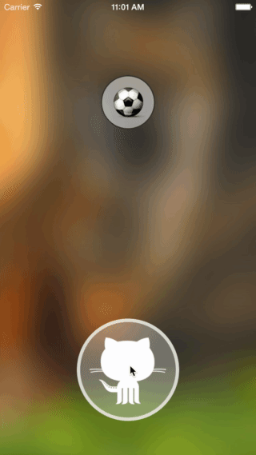

# GUIRoundProgressButton

[](http://cocoadocs.org/docsets/GUIRoundProgressButton) []() []()



## Installation
**CocoaPods** (recommended)  
Add the following line to your `Podfile`:  
`pod 'GUIRoundProgressButton', '~> 0.0.2`  
And then add `#import <GUIRoundProgressButton.h>` to your view controller.

**Manual**  
Copy the folders `Classes` to your project, then add `#import "GUIRoundProgressButton.h"` to your view controller.

## Usage
To use it, you should create a view controller that extends `GUIRoundProgressButton`. That can be done in two ways:

### Using the Interface Builder
* Add a `UIView` object to you view
* Change its class to `GUIRoundProgressButton`
* Create an `IBOutlet` in your view or view controller source file

### Adding the button programmatically
* Create an instance: `GUIRoundProgressButton *button = [GUIRoundProgressButton buttonWithCenter:<#CGPoint#> radius:<#CGFloat#>];`
* Add it as a subview: `[self.view addSubview:button];`

### Customizing
These are the methods you can use to change the look and feel of your button. The *"touch"* methods relate to the color while the button is being pressed by the user and while the action is in progress.

#### Content Padding
```obj-c
- (CGFloat)setContentPadding;
```

#### Border
```obj-c
- (CGFloat)setBorderWidth;
- (UIColor *)setBorderColor;
- (UIColor *)setTouchBorderColor;
```

#### Color
```obj-c
- (UIColor *)setForegroundColor;
- (UIColor *)setTouchForegroundColor;
```
#### Progress Indicator
```obj-c
- (UIColor *)setProgressIndicatorColor;
```

#### Image
```obj-c
- (void)setImage:(UIImage *)image;
```

#### Text
```obj-c
- (void)setText:(NSString *)text;
- (void)setAttributedText:(NSAttributedString *)text;
```

**NOTE:** either the image or the text will be visible. If both are set, the one which was set last is the one that will be used.

#### Action
This is the action the button will perform once it has been tapped.

```obj-c
- (void)setActionBlock:^(GUIRoundProgressButton *weakButton);
```

##### Example
```obj-c
[button setActionBlock:^(GUIRoundProgressButton *weakButton) {
  // Perform your tasks here

  // At the end, call finish using the weak reference to prevent memory leaks
  [weakButton finish];
}];
```

**NOTE:** do not forget to call the `finish` method at the end of your tasks. Use the weak reference to the button to prevent memory leaks.
